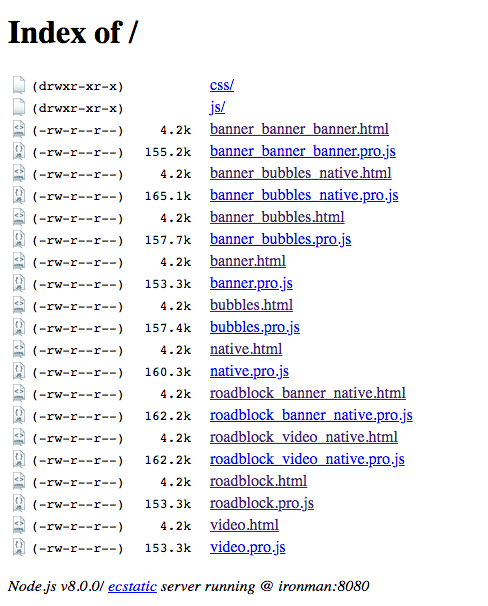

# OpenAds-demo
Demo collection of ads


# Performance
To know how much performance is affected by different type of ads we have created a task to launch an HTTP server with all combinations of ads.
Every combination has his own independent HTML file so we can use Lighthouse in a isolated way for every case.

`````bash
npm run demo:performance
`````

This will launch an HTTP server on port 8080 with 10 HTML pages. You can check the index of pages just requesting the index of the server:

````
http://ironman:8080/
````


Pay attention in the **DNS** name of my server, to be able to see the ads, due a limitation of Appnexus server, you must use the HTTP server throught a local DNS different from "localhost" because Appnexus denies requests comming from "localhost".
Now, just open any HTML file and run the performance analysis with Lighthouse, a good recommendation is doing it in **incognite mode** of the browser, the test will be more reliable.


   